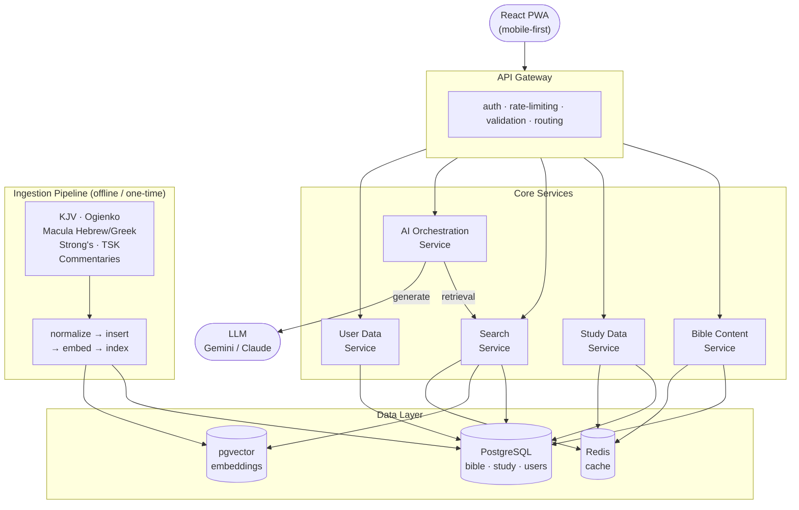

# Backend Architecture



---

## Read Path

| User action | Service hit | Store |
|---|---|---|
| Open chapter | Bible Content | Postgres → Redis cache |
| Tap word | Study Data | Postgres (Strong's, morphology) |
| Tap verse | Study Data | Postgres (cross-refs, commentary) |
| Natural-language search | AI Orchestration → Search | pgvector + Postgres full-text |
| Save highlight / note | User Data | Postgres |

## Write Path (ingestion, run once per dataset update)

```
Source files → Normalizer scripts → Postgres (verse texts, tokens, lexicon, commentary)
                                  → pgvector (text embeddings per verse)
                                  → Postgres FTS index (tsvector)
```

## Key Design Decisions

- **Postgres + pgvector** — one database for all structured data + vector search (no separate vector infra at MVP scale)
- **Redis** — chapter and study data cached after first request; AI search results cached by query hash
- **Ingestion is offline** — no live dependency on external Bible APIs; all content owned internally
- **AI = retrieval first, LLM second** — top-K passages retrieved before any LLM call; whole-Bible context never sent to model
